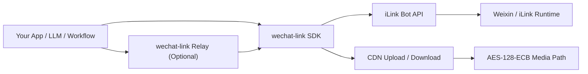
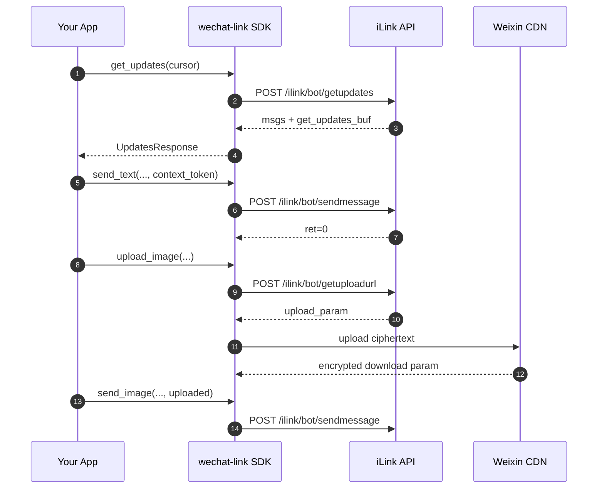

# wechat-link

<div align="center">


[](https://github.com/syusama/wechat-link)

**An unofficial Python SDK for iLink-compatible Weixin Bot integration, focused on protocol clarity, media workflows, and an optional thin relay.**

[简体中文](./README.md) | [English](./README.en.md) | [日本語](./README.ja.md)

[Quick Start](#quick-start) · [Capability Matrix](#capability-matrix) · [Relay](#relay-expose-the-sdk-as-an-http-service) · [Contributing](./CONTRIBUTING.md)

</div>

---


## At a Glance

| Good fit if you want to... | Probably not a fit if you want... |
| --- | --- |
| embed iLink-compatible messaging into your own Python service | a ready-made operations dashboard |
| own the polling, media, and delivery flow yourself | a multi-account control panel |
| connect Weixin bot capability to LLMs, workflows, and internal systems | something positioned as an official Tencent alternative |

## Positioning

`wechat-link` is not trying to become an all-in-one bot platform, and it is not presented as a replacement for any official Tencent offering.

Its scope is intentionally narrow and explicit:

> **Turn the core iLink / Weixin Bot HTTP protocol into a clean, reusable, embeddable Python SDK, with an optional thin relay on top.**

That means the project prioritizes:
- a well-defined protocol boundary
- stable and composable SDK APIs
- complete media upload / send flows
- easy integration with your own app, LLM stack, workflow engine, or service backend

Not the following:
- admin consoles
- growth / operations platforms
- multi-account control panels
- framework-heavy runtime abstractions from day one

## Why `wechat-link`

Many projects in this space quickly grow into “bot applications” where protocol handling, runtime state, business logic, and product features are tightly coupled.

`wechat-link` takes a more restrained approach:

- stabilize login primitives, polling, messaging, typing, and media flows first
- keep the relay as a thin wrapper over the SDK, not a second product
- put protocol details into explicit models and interfaces
- make the SDK easy to integrate with FastAPI, Django, LangChain, queues, and internal services
- avoid promising surface area that the project does not actually maintain

## Architecture



### Internal layers

- **`wechat_link.client`** — core iLink API client
- **`wechat_link.media`** — media orchestration, thumbnail metadata, CDN upload flow
- **`wechat_link.cdn` / `wechat_link.crypto`** — CDN transport and AES details
- **`wechat_link.relay`** — thin FastAPI relay layer
- **`wechat_link.store`** — minimal persistence helper for `get_updates_buf`

## Lifecycle and Data Flow



## Capability Matrix

| Capability | Status | Notes |
| --- | --- | --- |
| Fetch login QR code | Available | `get_bot_qrcode()` |
| Query QR code status | Available | `get_qrcode_status()` |
| Long-poll inbound updates | Available | `get_updates()` |
| Persist polling cursor | Available | `FileCursorStore` |
| Send text messages | Available | `send_text()` |
| Fetch typing config | Available | `get_config()` |
| Send typing state | Available | `send_typing()` |
| Request upload URL | Available | `get_upload_url()` |
| Upload / send image | Available | `upload_image()` / `send_image()` |
| Upload / send file | Available | `upload_file()` / `send_file()` |
| Upload / send video | Available | Explicit `thumb_path` supported |
| Upload / send voice | Available | `upload_voice()` / `send_voice()` |
| Thin relay service | Available | FastAPI-based relay |
| Automatic video frame extraction | Not implemented | No implicit media processing |
| Automatic audio transcoding | Not implemented | No ffmpeg / silk toolchain bundled |
| Full bot runtime | Not a current goal | SDK-first boundary |

## Installation

### Install from source

```bash
git clone https://github.com/syusama/wechat-link.git
cd wechat-link
pip install -e .
```

### Install relay extras

```bash
pip install -e .[relay]
```

### Development setup

```bash
pip install -e .[dev]
pytest -q
```

## Quick Start

### 1) Poll updates and build a simple echo bot

```python
import time

from wechat_link import FileCursorStore, WeChatLinkClient

client = WeChatLinkClient(bot_token="your-bot-token")
store = FileCursorStore(".state/get_updates_buf.json")
cursor = store.load() or ""

try:
    while True:
        updates = client.get_updates(cursor=cursor)

        if updates.next_cursor:
            cursor = updates.next_cursor
            store.save(cursor)

        for message in updates.messages:
            text = message.text().strip()
            if not text or not message.from_user_id or not message.context_token:
                continue

            client.send_text(
                to_user_id=message.from_user_id,
                text=f"echo: {text}",
                context_token=message.context_token,
            )

        time.sleep(1)
finally:
    client.close()
```

See: `examples/echo_bot.py`

### 2) Low-level QR login primitives

The current SDK intentionally provides **QR login primitives**, not a full login orchestrator.

```python
import time

from wechat_link import WeChatLinkClient

client = WeChatLinkClient()
qr = client.get_bot_qrcode()
print(qr.qrcode)

while True:
    status = client.get_qrcode_status(qr.qrcode)
    print(status.status)

    if status.status == "confirmed":
        print("bot_token:", status.bot_token)
        print("baseurl:", status.baseurl)
        print("ilink_bot_id:", status.ilink_bot_id)
        print("ilink_user_id:", status.ilink_user_id)
        break

    time.sleep(1)
```

That is intentional. At this stage, protocol clarity matters more than adding a heavier runtime layer.

### 3) Send image and video

```python
from wechat_link.client import WeChatLinkClient

client = WeChatLinkClient(bot_token="your-bot-token")

uploaded = client.upload_image(
    file_path="demo.jpg",
    to_user_id="user@im.wechat",
)

client.send_image(
    to_user_id="user@im.wechat",
    uploaded=uploaded,
    context_token="ctx-from-inbound-message",
)

uploaded_video = client.upload_video(
    file_path="demo.mp4",
    to_user_id="user@im.wechat",
    thumb_path="thumb.jpg",
)

client.send_video(
    to_user_id="user@im.wechat",
    uploaded=uploaded_video,
    context_token="ctx-from-inbound-message",
)

client.close()
```

See: `examples/send_media.py`

## Relay: Expose the SDK as HTTP

If you want to bridge the SDK into another language, service, or internal platform, the built-in relay gives you a thin HTTP boundary without turning the project into a larger framework.

### Start the relay

```bash
uvicorn examples.relay_server:app --reload
```

See: `examples/relay_server.py`

### Available routes

| Method | Path | Purpose |
| --- | --- | --- |
| `GET` | `/health` | Health check |
| `GET` | `/login/qrcode` | Fetch login QR code |
| `GET` | `/login/status` | Query QR code status |
| `POST` | `/config` | Fetch typing config |
| `POST` | `/typing` | Send typing state |
| `POST` | `/updates/poll` | Poll updates |
| `POST` | `/messages/text` | Send text message |
| `POST` | `/messages/image/upload` | Upload and send image |
| `POST` | `/messages/file/upload` | Upload and send file |
| `POST` | `/messages/video/upload` | Upload and send video |
| `POST` | `/messages/voice/upload` | Upload and send voice |

### Relay example

```bash
curl -X POST http://127.0.0.1:8000/messages/image/upload \
  -F "to_user_id=user@im.wechat" \
  -F "context_token=ctx-1" \
  -F "file=@demo.jpg"
```

```bash
curl -X POST http://127.0.0.1:8000/messages/video/upload \
  -F "to_user_id=user@im.wechat" \
  -F "context_token=ctx-1" \
  -F "file=@demo.mp4" \
  -F "thumb_file=@thumb.jpg"
```

## Protocol Notes

### 1. `context_token` is part of the reply contract

When replying inside the same conversation, you must send back the `context_token` from the upstream message. `wechat-link` does not try to guess that context for you.

### 2. `get_updates_buf` must be persisted

`get_updates_buf` is your long-poll cursor. If you do not persist it, duplicate consumption is the most common failure mode. `FileCursorStore` exists as a small but practical helper for this exact reason.

### 3. Media delivery is a workflow, not a single API call

In practice, media sending consists of three steps:
1. call `get_upload_url()`
2. upload encrypted bytes to the CDN
3. build and send a media message through `sendmessage`

### 4. Headers are constructed automatically

The SDK automatically builds the key protocol headers for CGI POST requests:

```text
Content-Type: application/json
AuthorizationType: ilink_bot_token
Authorization: Bearer <bot_token>
X-WECHAT-UIN: base64(decimal(random_uint32))
```

### 5. Media flows include AES-128-ECB handling

The current implementation already covers:
- CDN upload parameter handling
- AES-128-ECB padded-size calculation
- encrypted download parameter propagation
- message packaging for image / file / video / voice

## Design Principles

### Stabilize the core path first
Keep the protocol, messaging, and media path solid before adding heavier runtime layers.

### Keep the relay optional
The relay is a bridge, not a platform.

### Avoid hidden behavior
Prefer clear, debuggable, explicit behavior over hidden automation.

### Keep the surface area disciplined
Do fewer things, but do the critical path well.

## Project Layout

```text
src/wechat_link/
├── __init__.py
├── cdn.py
├── client.py
├── crypto.py
├── headers.py
├── media.py
├── message_builders.py
├── models.py
├── relay.py
└── store.py

examples/
├── echo_bot.py
├── relay_server.py
└── send_media.py

tests/
├── test_cdn.py
├── test_client.py
├── test_crypto.py
├── test_cursor_store.py
├── test_headers.py
├── test_media_client.py
├── test_media_helpers.py
├── test_message_builders.py
├── test_relay.py
├── test_relay_helpers.py
└── test_relay_media.py
```

## What Comes Next

The near-term roadmap remains intentionally focused on the core path:

- stronger protocol documentation and error semantics
- better media parameter validation and developer ergonomics
- keeping the relay thin and predictable
- adding high-level helpers only when they simplify real integrations without distorting the SDK boundary

## Explicit Boundaries

`wechat-link` is an **unofficial project**.

It does not represent Tencent, should not be described as an official platform, and should not be packaged as an “official replacement”. A more accurate description is:

> **An unofficial Python SDK for iLink-compatible Weixin bot integration.**

The project also does **not** aim to be:
- a multi-account operations console
- a mass-control platform
- a marketing automation dashboard
- a large bot framework tightly coupled to the protocol layer

## Acknowledgements

Protocol research and implementation boundaries were informed by public upstream work and community practice, including:
- [`hao-ji-xing/cc-weixin`](https://github.com/hao-ji-xing/cc-weixin)
- the public `openclaw-weixin` source layout
- existing community experimentation around the iLink Bot protocol

The goal of `wechat-link` is not to clone another project’s product shape, but to shape this protocol surface into a cleaner, more reusable foundation for the Python ecosystem.

## Contributing

If you plan to open an issue or PR, start here:

- [`CONTRIBUTING.md`](./CONTRIBUTING.md)

The most useful contribution areas right now are:

- protocol verification and correction
- media workflow stability and edge cases
- stronger tests and documentation accuracy
- structural cleanup without expanding project scope

## License

MIT
