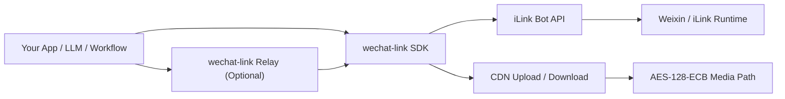
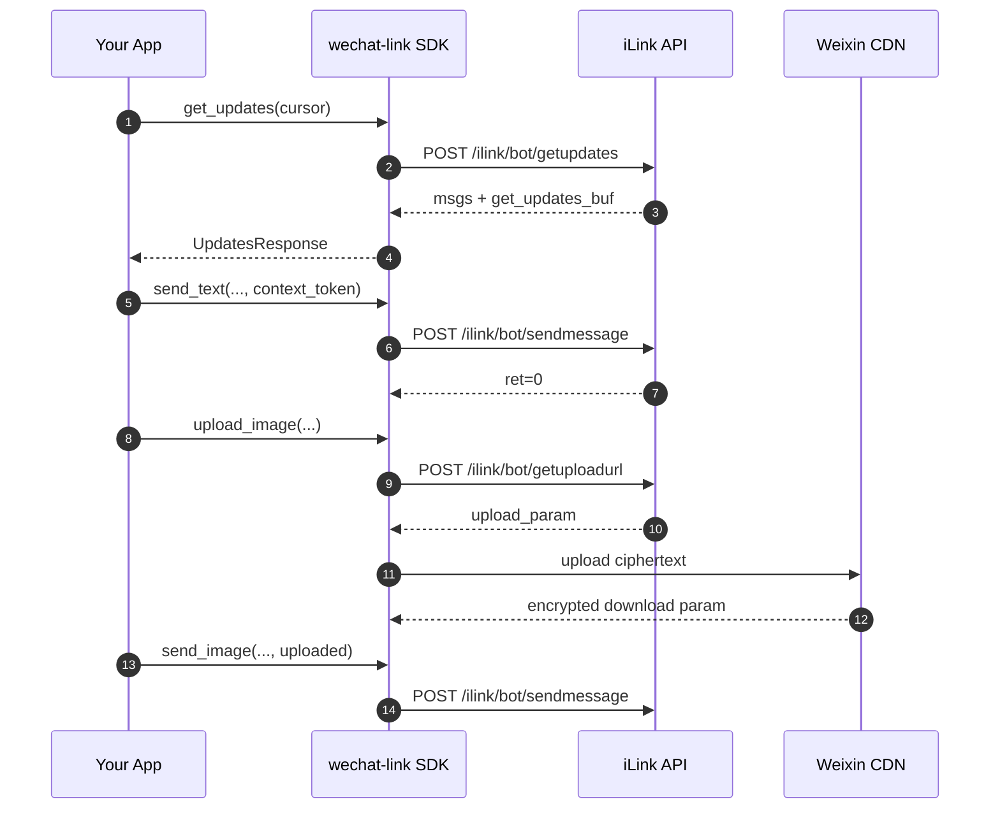

# wechat-link

<div align="center">


[](https://github.com/syusama/wechat-link)

**Connect WeChat to your app, agent, or workflow in one line of code.**

Scan to log in, then use a few lines of Python to receive messages, reply, and send media.  
No full bot platform to build first. No protocol rabbit hole to fight through first.

[简体中文](./README.md) | [English](./README.en.md) | [日本語](./README.ja.md)

[Install](#install-in-30-seconds) · [Why It Feels Easy](#why-it-feels-easy) · [Quick Start](#quick-start) · [Capability Matrix](#capability-matrix) · [Relay](#relay-expose-the-sdk-as-an-http-service) · [Contributing](./CONTRIBUTING.md)

</div>

---


## Install in 30 Seconds

### Install from PyPI

```bash
pip install wechat-link
```

### Install relay extras

```bash
pip install "wechat-link[relay]"
```

### Minimal usage example

```python
from wechat_link import Client

client = Client(bot_token="your-bot-token")
messages = client.get_updates(cursor="").messages

print("messages:", len(messages))

client.close()
```

## What It Saves You From

When people try to connect WeChat, the real pain is usually not the business logic. It is all the setup friction around it:

- not wanting to build an entire bot platform just to get WeChat connected
- not wanting to reverse-engineer login, polling, context tokens, and media upload details
- not wanting to spend your time on protocol and CDN plumbing instead of your actual product
- not wanting the integration cost to kill momentum before the project even starts

`wechat-link` keeps the promise simple:

> **Compress WeChat integration into a small amount of clear code so you can get it working first and extend it your own way later.**

## Why It Feels Easy

- login, receive, reply, typing, and media flows are already wired up
- it drops into an existing Python app without forcing a new stack or platform
- use the SDK directly, or add the thin relay if you want to expose it over HTTP
- keep your business logic, agents, workflows, and internal systems organized your way
- the project stays intentionally small instead of turning into a heavy “everything platform”

## Good Fit For

- connecting WeChat to an existing app, internal tool, or automation flow
- letting an LLM, agent, or workflow send and receive through WeChat
- getting the message path working first, then layering business logic on top
- keeping control over your code, deployment model, and integration boundaries

This is still an unofficial project, and it is not pretending to be an official Tencent replacement.  
If you want a full operations console or a multi-account platform, that is not the goal here. If you want a **simple, fast, embeddable way to connect WeChat**, this project is built for that.

## Architecture



### Internal layers

- **`wechat_link.client`** — core iLink API client
- **`wechat_link.media`** — media orchestration, thumbnail metadata, CDN upload flow
- **`wechat_link.cdn` / `wechat_link.crypto`** — CDN transport and AES details
- **`wechat_link.relay`** — thin FastAPI relay layer
- **`wechat_link.store`** — minimal persistence helper for `get_updates_buf`

## Lifecycle and Data Flow



## Capability Matrix

| Capability | Status | Notes |
| --- | --- | --- |
| Fetch login QR code | Available | `get_bot_qrcode()` |
| Print QR in terminal | Available | `render_qrcode_terminal()` / `print_qrcode_terminal()` |
| Query QR code status | Available | `get_qrcode_status()` |
| Long-poll inbound updates | Available | `get_updates()` |
| Persist polling cursor | Available | `FileCursorStore` |
| Send text messages | Available | `send_text()` |
| Fetch typing config | Available | `get_config()` |
| Send typing state | Available | `send_typing()` |
| Request upload URL | Available | `get_upload_url()` |
| Upload / send image | Available | `upload_image()` / `send_image()` |
| Upload / send file | Available | `upload_file()` / `send_file()` |
| Upload / send video | Available | Explicit `thumb_path` supported |
| Upload / send voice | Available | `upload_voice()` / `send_voice()` |
| Thin relay service | Available | FastAPI-based relay |
| Automatic video frame extraction | Not implemented | No implicit media processing |
| Automatic audio transcoding | Not implemented | No ffmpeg / silk toolchain bundled |
| Full bot runtime | Not a current goal | SDK-first boundary |

## Installation

### Install from PyPI (recommended)

```bash
pip install wechat-link
```

### Install relay extras

```bash
pip install "wechat-link[relay]"
```

### Install from source (development)

```bash
git clone https://github.com/syusama/wechat-link.git
cd wechat-link
pip install -e .
```

### Development setup

```bash
pip install -e .[dev]
pytest -q
```

## Recommended Flow

For a first integration, follow this order:

1. **Run QR login first** and obtain `bot_token`
2. **Initialize `Client`** with that `bot_token`
3. **Start polling, sending messages, and uploading media**

Important detail:

- After QR confirmation, you will typically receive `bot_token`, `baseurl`, `ilink_bot_id`, and `ilink_user_id`
- The value the SDK actually needs for `Client(...)` is **`bot_token`**
- `ilink_bot_id` is useful metadata, but it is not a substitute for `bot_token`

## Quick Start

### 1) Run QR login and get `bot_token`

The current SDK intentionally provides **QR login primitives**, not a full login orchestrator.

The simplest way to run this step is:

```bash
python examples/login_session.py
```

```python
import time
from pathlib import Path

from wechat_link import Client

client = Client()
qr = client.get_bot_qrcode()
image_path = client.save_qrcode_image(
    qr.qrcode_img_content,
    output_path=Path(".state") / "wechat-login-qrcode.png",
)

print(qr.qrcode)
print(image_path)
print(qr.qrcode_img_content)
print(client.render_qrcode_terminal(qr.qrcode_img_content))

while True:
    status = client.get_qrcode_status(qr.qrcode)
    print(status.status)

    if status.status == "confirmed":
        print("bot_token:", status.bot_token)
        print("baseurl:", status.baseurl)
        print("ilink_bot_id:", status.ilink_bot_id)
        print("ilink_user_id:", status.ilink_user_id)
        break

    time.sleep(1)
```

That script saves the session into `.state/wechat-link-session.json`. The main thing to keep is `bot_token`. The next `Client(bot_token=...)` examples use that value. Right now `qrcode_img_content` is a reachable URL; if that URL points to a QR page instead of a raw image, the SDK generates a real QR code locally. `save_qrcode_image(...)` saves the result as a local image file, and `render_qrcode_terminal(...)` / `print_qrcode_terminal(...)` can render it directly in the terminal.

### 2) Receive one WeChat message first

The simplest way to run this step is:

```bash
python examples/receive_once.py
```

This example:

- loads `bot_token` from local `.state/wechat-link-session.json`
- makes one `get_updates()` long-poll request
- prints `from_user_id`, `context_token`, and `text`
- saves the last replyable message into `.state/last-message-context.json`

The core receive flow is just:

```python
updates = client.get_updates(cursor=cursor)

for message in updates.messages:
    print(message.from_user_id)
    print(message.context_token)
    print(message.text())
```

If the script looks like it is doing nothing, it is usually just waiting for a new inbound message. Start `examples/receive_once.py`, then send a fresh text message to the bot from WeChat.

### 3) Reply to the message you just received

The simplest way to run this step is:

```bash
python examples/reply_once.py
```

The core reply call is:

```python
client.send_text(
    to_user_id=message.from_user_id,
    text=f"received: {text}",
    context_token=message.context_token,
)
```

This is why `context_token` matters: you are replying inside the same conversation, not cold-starting a message to an arbitrary user.

### 4) Send one more text in the same session

The simplest way to run this step is:

```bash
python examples/send_text_in_session.py
```

It reads `.state/last-message-context.json` and sends one more text into the same session:

```python
client.send_text(
    to_user_id=context["from_user_id"],
    text="this is a proactive message in the same session",
    context_token=context["context_token"],
)
```

### 5) Supplement: send an image in an existing session

```python
uploaded = client.upload_image(
    file_path="demo.jpg",
    to_user_id="user@im.wechat",
)

client.send_image(
    to_user_id="user@im.wechat",
    uploaded=uploaded,
    context_token="ctx-from-inbound-message",
)
```

For file / video / voice examples, see `examples/send_media.py`

### 6) Recommended example order

For the clearest learning path, run the examples in this order:

1. `python examples/login_session.py`
2. `python examples/receive_once.py`
3. `python examples/reply_once.py`
4. `python examples/send_text_in_session.py`
5. `python examples/echo_bot.py`

## Fast Onboarding Tutorial

If you want a **copy-paste runnable full flow**, start with this three-step example.

Run it with:

```bash
python examples/quickstart_three_steps.py
```

Repository examples prefer local `src/wechat_link` first, so they do not accidentally import an older installed package from `site-packages`. They also write the QR image, session, and cursor files into the repository-level `.state/` directory and print absolute paths.

If you want the split, minimal learning path instead of the all-in-one flow, start with:

- `examples/login_session.py`
- `examples/receive_once.py`
- `examples/reply_once.py`
- `examples/send_text_in_session.py`
- `examples/echo_bot.py`

The script will:

1. Request a login QR code, save the QR image to repository `.state/wechat-login-qrcode.png`, and print the QR in the terminal
2. Poll QR status and save `bot_token` plus session metadata to repository `.state/wechat-link-session.json`
3. Start an echo loop with the saved `bot_token`

See the runnable example in: `examples/quickstart_three_steps.py`

## Relay: Expose the SDK as HTTP

If you want to bridge the SDK into another language, service, or internal platform, the built-in relay gives you a thin HTTP boundary without turning the project into a larger framework.

### Start the relay

```bash
uvicorn examples.relay_server:app --reload
```

See: `examples/relay_server.py`

### Available routes

| Method | Path | Purpose |
| --- | --- | --- |
| `GET` | `/health` | Health check |
| `GET` | `/login/qrcode` | Fetch login QR code |
| `GET` | `/login/status` | Query QR code status |
| `POST` | `/config` | Fetch typing config |
| `POST` | `/typing` | Send typing state |
| `POST` | `/updates/poll` | Poll updates |
| `POST` | `/messages/text` | Send text message |
| `POST` | `/messages/image/upload` | Upload and send image |
| `POST` | `/messages/file/upload` | Upload and send file |
| `POST` | `/messages/video/upload` | Upload and send video |
| `POST` | `/messages/voice/upload` | Upload and send voice |

### Relay example

```bash
curl -X POST http://127.0.0.1:8000/messages/image/upload \
  -F "to_user_id=user@im.wechat" \
  -F "context_token=ctx-1" \
  -F "file=@demo.jpg"
```

```bash
curl -X POST http://127.0.0.1:8000/messages/video/upload \
  -F "to_user_id=user@im.wechat" \
  -F "context_token=ctx-1" \
  -F "file=@demo.mp4" \
  -F "thumb_file=@thumb.jpg"
```

## Protocol Notes

### 1. `context_token` is part of the reply contract

When replying inside the same conversation, you must send back the `context_token` from the upstream message. `wechat-link` does not try to guess that context for you.

### 2. `get_updates_buf` must be persisted

`get_updates_buf` is your long-poll cursor. If you do not persist it, duplicate consumption is the most common failure mode. `FileCursorStore` exists as a small but practical helper for this exact reason.

### 3. Media delivery is a workflow, not a single API call

In practice, media sending consists of three steps:
1. call `get_upload_url()`
2. upload encrypted bytes to the CDN
3. build and send a media message through `sendmessage`

### 4. Headers are constructed automatically

The SDK automatically builds the key protocol headers for CGI POST requests:

```text
Content-Type: application/json
AuthorizationType: ilink_bot_token
Authorization: Bearer <bot_token>
X-WECHAT-UIN: base64(decimal(random_uint32))
```

### 5. Media flows include AES-128-ECB handling

The current implementation already covers:
- CDN upload parameter handling
- AES-128-ECB padded-size calculation
- encrypted download parameter propagation
- message packaging for image / file / video / voice

## Explicit Boundaries

`wechat-link` is an **unofficial project**.

It does not represent Tencent, should not be described as an official platform, and should not be packaged as an “official replacement”. A more accurate description is:

> **An unofficial Python SDK for iLink-compatible Weixin bot integration.**

The project also does **not** aim to be:
- a multi-account operations console
- a mass-control platform
- a marketing automation dashboard
- a large bot framework tightly coupled to the protocol layer

## Contributing

If you plan to open an issue or PR, start here:

- [`CONTRIBUTING.md`](./CONTRIBUTING.md)

The most useful contribution areas right now are:

- protocol verification and correction
- media workflow stability and edge cases
- stronger tests and documentation accuracy
- structural cleanup without expanding project scope

## License

MIT
