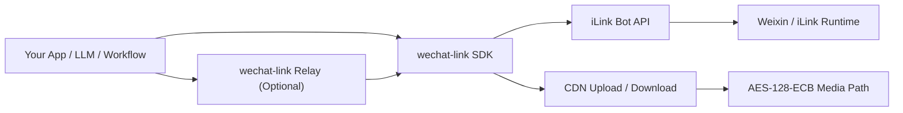
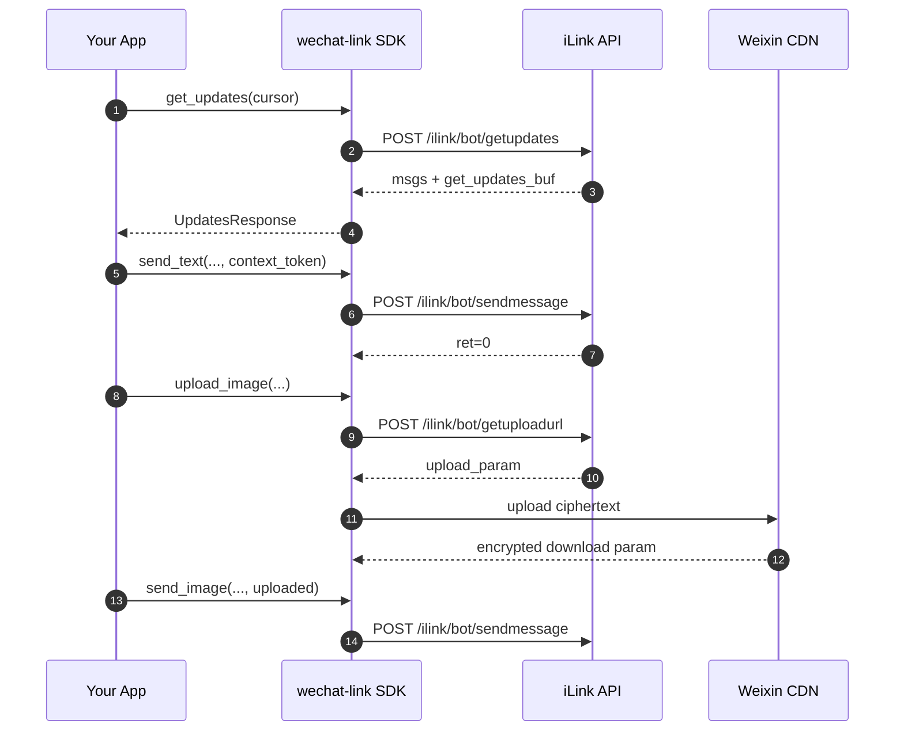

# wechat-link

<div align="center">


[](https://github.com/syusama/wechat-link)

**1行で WeChat をつなぐ。アプリ、Agent、ワークフローをそのままチャット画面へ。**

QR を読み取ってログインすれば、数行の Python で受信、返信、画像やファイル送信まで始められます。  
先に大きな Bot 基盤を作る必要も、複雑なプロトコルを掘る必要もありません。

[简体中文](./README.md) | [English](./README.en.md) | [日本語](./README.ja.md)

[インストール](#すぐにインストール) · [使いやすい理由](#使いやすい理由) · [クイックスタート](#クイックスタート) · [機能マトリクス](#現在の機能マトリクス) · [Relay](#relaysdk-を-http-サービスとして公開する) · [Contributing](./CONTRIBUTING.md)

</div>

---


## すぐにインストール

### PyPI から導入

```bash
pip install wechat-link
```

### Relay 依存も入れる

```bash
pip install "wechat-link[relay]"
```

### インストール後の最小例

```python
from wechat_link import Client

client = Client(bot_token="your-bot-token")
messages = client.get_updates(cursor="").messages

print("messages:", len(messages))

client.close()
```

## このプロジェクトが省いてくれるもの

WeChat 連携で本当に大変なのは、業務ロジックそのものより、接続までの面倒さであることが多いです。

- WeChat をつなぐだけなのに、最初から大きな Bot プラットフォームを作りたくない
- ログイン、ポーリング、context token、メディア送信の細部を自分で追いたくない
- プロトコルや CDN の配線より、自分のプロダクトに時間を使いたい
- 連携コストの高さで、作り始める前に勢いを失いたくない

`wechat-link` がやることはシンプルです。

> **WeChat 連携を少量の分かりやすいコードに圧縮して、まず動かし、その後は自分のやり方で広げられるようにすること。**

## 使いやすい理由

- ログイン、受信、返信、typing、画像/ファイル/動画/音声の流れが最初からそろっている
- 既存の Python アプリにそのまま組み込みやすく、新しい技術スタックを強制しない
- SDK を直接使ってもよいし、HTTP 化したければ薄い Relay を足すだけでよい
- 業務ロジック、Agent、ワークフロー、社内システムは自分の構成のまま保てる
- 何でも入りの巨大基盤にせず、扱いやすい範囲に意図的に絞っている

## 向いている場面

- WeChat を既存アプリ、社内ツール、自動化フローにつなぎたい
- LLM / Agent / ワークフローから WeChat で送受信したい
- まず通信経路を通し、その後に業務機能を積み上げたい
- コード、デプロイ、統合境界を自分でコントロールしたい

このプロジェクトは非公式であり、Tencent の公式代替を装うものではありません。  
運用コンソールやマルチアカウント基盤が欲しいなら目的が違います。必要なのが **シンプルで、速く、組み込みやすい WeChat 連携** なら、そのために作られています。

## アーキテクチャ



### 内部レイヤー

- **`wechat_link.client`** — iLink API の中核クライアント
- **`wechat_link.media`** — メディア送信の編成、サムネイル情報、CDN アップロード
- **`wechat_link.cdn` / `wechat_link.crypto`** — CDN 通信と AES の詳細
- **`wechat_link.relay`** — 薄い FastAPI Relay 層
- **`wechat_link.store`** — `get_updates_buf` の最小永続化ヘルパー

## ライフサイクルとデータフロー



## 現在の機能マトリクス

| 機能 | 状態 | 備考 |
| --- | --- | --- |
| ログイン QR コード取得 | 実装済み | `get_bot_qrcode()` |
| ターミナル QR 表示 | 実装済み | `render_qrcode_terminal()` / `print_qrcode_terminal()` |
| QR 状態確認 | 実装済み | `get_qrcode_status()` |
| 長輪詢での受信 | 実装済み | `get_updates()` |
| カーソル永続化 | 実装済み | `FileCursorStore` |
| テキスト送信 | 実装済み | `send_text()` |
| typing 設定取得 | 実装済み | `get_config()` |
| typing 状態送信 | 実装済み | `send_typing()` |
| アップロード URL 取得 | 実装済み | `get_upload_url()` |
| 画像アップロード / 送信 | 実装済み | `upload_image()` / `send_image()` |
| ファイルアップロード / 送信 | 実装済み | `upload_file()` / `send_file()` |
| 動画アップロード / 送信 | 実装済み | `thumb_path` を明示指定可能 |
| 音声アップロード / 送信 | 実装済み | `upload_voice()` / `send_voice()` |
| 薄い Relay サービス | 実装済み | FastAPI ベース |
| 動画の自動サムネイル抽出 | 未実装 | 暗黙処理は行わない |
| 音声の自動トランスコード | 未実装 | ffmpeg / silk は同梱しない |
| 完全な Bot Runtime | 現段階の目標外 | SDK-first を維持 |

## インストール

### PyPI から導入（推奨）

```bash
pip install wechat-link
```

### Relay 依存を含めて導入

```bash
pip install "wechat-link[relay]"
```

### ソースから導入（開発向け）

```bash
git clone https://github.com/syusama/wechat-link.git
cd wechat-link
pip install -e .
```

### 開発環境

```bash
pip install -e .[dev]
pytest -q
```

## はじめる順番

初回導入では、次の順番で進めるのが分かりやすいです。

1. **まず QR ログインを実行**して `bot_token` を取得する
2. **その `bot_token` で `Client` を初期化**する
3. **その後に受信・送信・メディア処理へ進む**

特に重要なのは次の点です。

- QR ログイン完了後には通常 `bot_token`、`baseurl`、`ilink_bot_id`、`ilink_user_id` が返ります
- `Client(...)` に渡すべき値は **`bot_token`** です
- `ilink_bot_id` は有用ですが、`bot_token` の代わりにはなりません

## クイックスタート

### 1) まず QR ログインで `bot_token` を取得する

現行バージョンでは、**QR ログインの原語**を提供しており、完全なログインオーケストレータはまだ含めていません。

最短の実行方法:

```bash
python examples/login_session.py
```

```python
import time
from pathlib import Path

from wechat_link import Client

client = Client()
qr = client.get_bot_qrcode()
image_path = client.save_qrcode_image(
    qr.qrcode_img_content,
    output_path=Path(".state") / "wechat-login-qrcode.png",
)

print(qr.qrcode)
print(image_path)
print(qr.qrcode_img_content)
print(client.render_qrcode_terminal(qr.qrcode_img_content))

while True:
    status = client.get_qrcode_status(qr.qrcode)
    print(status.status)

    if status.status == "confirmed":
        print("bot_token:", status.bot_token)
        print("baseurl:", status.baseurl)
        print("ilink_bot_id:", status.ilink_bot_id)
        print("ilink_user_id:", status.ilink_user_id)
        break

    time.sleep(1)
```

このスクリプトは `.state/wechat-link-session.json` にセッションを保存します。ここで最も重要なのは `bot_token` を保存することです。後続の `Client(bot_token=...)` はその値を使います。現在の `qrcode_img_content` はアクセス可能な URL であり、その URL が生画像ではなく QR ページを返す場合でも、SDK がローカルで本物の QR コードを生成します。`save_qrcode_image(...)` はその結果をローカル画像として保存し、`render_qrcode_terminal(...)` / `print_qrcode_terminal(...)` ならターミナルにも表示できます。

### 2) まず 1 件メッセージを受信する

最短の実行方法:

```bash
python examples/receive_once.py
```

このサンプルは次を行います。

- ローカル `.state/wechat-link-session.json` から `bot_token` を読む
- `get_updates()` を 1 回だけ長輪詢する
- `from_user_id`、`context_token`、`text` を表示する
- 返信に使える最新メッセージを `.state/last-message-context.json` に保存する

受信の本質は次の部分です。

```python
updates = client.get_updates(cursor=cursor)

for message in updates.messages:
    print(message.from_user_id)
    print(message.context_token)
    print(message.text())
```

反応がないように見える場合、多くは壊れているのではなく、新しい受信メッセージを待っています。`examples/receive_once.py` を起動した後、WeChat から Bot に新しいテキストを送ってください。

### 3) 受け取ったメッセージに返信する

最短の実行方法:

```bash
python examples/reply_once.py
```

返信の中核は次の呼び出しです。

```python
client.send_text(
    to_user_id=message.from_user_id,
    text=f"received: {text}",
    context_token=message.context_token,
)
```

ここで重要なのが `context_token` です。任意ユーザーへいきなり送るのではなく、同じ会話文脈に返信しています。

### 4) 同じ会話でさらに 1 件テキストを送る

最短の実行方法:

```bash
python examples/send_text_in_session.py
```

このサンプルは `.state/last-message-context.json` を読み、同じ会話にもう 1 件テキストを送ります。

```python
client.send_text(
    to_user_id=context["from_user_id"],
    text="this is a proactive message in the same session",
    context_token=context["context_token"],
)
```

### 5) 補足: 既存セッションで画像を送る

```python
uploaded = client.upload_image(
    file_path="demo.jpg",
    to_user_id="user@im.wechat",
)

client.send_image(
    to_user_id="user@im.wechat",
    uploaded=uploaded,
    context_token="ctx-from-inbound-message",
)
```

ファイル / 動画 / 音声の例は `examples/send_media.py` を参照してください

### 6) おすすめの実行順

初回は次の順で試すのが一番わかりやすいです。

1. `python examples/login_session.py`
2. `python examples/receive_once.py`
3. `python examples/reply_once.py`
4. `python examples/send_text_in_session.py`
5. `python examples/echo_bot.py`

## クイックスタート完全版

**そのままコピーして試せる一連の流れ**を使いたい場合は、この 3 ステップ例から始めるのが最短です。

実行コマンド:

```bash
python examples/quickstart_three_steps.py
```

リポジトリ内のサンプルは、まずローカルの `src/wechat_link` を優先して読み込むため、`site-packages` に入っている旧版を誤って使いません。さらに、QR 画像・セッション・カーソルのファイルはリポジトリ直下の `.state/` に保存され、絶対パスも出力されます。

一体型ではなく、分解された最小ステップで理解したい場合は、次のサンプルから始めてください。

- `examples/login_session.py`
- `examples/receive_once.py`
- `examples/reply_once.py`
- `examples/send_text_in_session.py`
- `examples/echo_bot.py`

このスクリプトは次を自動で行います。

1. ログイン用 QR コードを取得し、リポジトリ直下の `.state/wechat-login-qrcode.png` に保存しつつ、ターミナルにも表示する
2. QR 状態をポーリングし、`bot_token` などをリポジトリ直下の `.state/wechat-link-session.json` に保存する
3. 保存した `bot_token` を使って echo ループを起動する

実行可能な完全版は `examples/quickstart_three_steps.py` を参照してください

## Relay: SDK を HTTP として公開する

Python SDK を別言語や別サービス、社内基盤につなぎたい場合は、内蔵の薄い Relay を使えます。大きなフレームワークにはせず、必要最小限の HTTP 境界だけを提供します。

### Relay の起動

```bash
uvicorn examples.relay_server:app --reload
```

対応例: `examples/relay_server.py`

### 提供ルート

| メソッド | パス | 用途 |
| --- | --- | --- |
| `GET` | `/health` | ヘルスチェック |
| `GET` | `/login/qrcode` | ログイン QR 取得 |
| `GET` | `/login/status` | QR 状態確認 |
| `POST` | `/config` | typing 設定取得 |
| `POST` | `/typing` | typing 状態送信 |
| `POST` | `/updates/poll` | 更新取得 |
| `POST` | `/messages/text` | テキスト送信 |
| `POST` | `/messages/image/upload` | 画像アップロード＋送信 |
| `POST` | `/messages/file/upload` | ファイルアップロード＋送信 |
| `POST` | `/messages/video/upload` | 動画アップロード＋送信 |
| `POST` | `/messages/voice/upload` | 音声アップロード＋送信 |

### Relay の利用例

```bash
curl -X POST http://127.0.0.1:8000/messages/image/upload \
  -F "to_user_id=user@im.wechat" \
  -F "context_token=ctx-1" \
  -F "file=@demo.jpg"
```

```bash
curl -X POST http://127.0.0.1:8000/messages/video/upload \
  -F "to_user_id=user@im.wechat" \
  -F "context_token=ctx-1" \
  -F "file=@demo.mp4" \
  -F "thumb_file=@thumb.jpg"
```

## プロトコル上の要点

### 1. `context_token` は返信契約の中核

同じ会話に返信する場合、上流メッセージの `context_token` を必ず引き継ぐ必要があります。`wechat-link` はその文脈を勝手に推測しません。

### 2. `get_updates_buf` は必ず永続化する

`get_updates_buf` は長輪詢カーソルです。永続化しないと、最も起きやすい問題は重複受信です。`FileCursorStore` はそのための小さく実用的なヘルパーです。

### 3. メディア送信は単一 API ではなくワークフロー

実際のメディア送信は通常、次の 3 段階です。
1. `get_upload_url()` を呼ぶ
2. 暗号化済みバイト列を CDN へアップロードする
3. `sendmessage` 用のメディアメッセージを組み立てて送る

### 4. ヘッダは SDK が自動構築する

SDK は主要な CGI POST リクエストに対して、次のヘッダを自動構築します。

```text
Content-Type: application/json
AuthorizationType: ilink_bot_token
Authorization: Bearer <bot_token>
X-WECHAT-UIN: base64(decimal(random_uint32))
```

### 5. メディア経路には AES-128-ECB 処理が含まれる

現行実装では、すでに次をカバーしています。
- CDN アップロードパラメータの処理
- AES-128-ECB のパディング後サイズ計算
- 暗号化ダウンロードパラメータの伝播
- 画像 / ファイル / 動画 / 音声のメッセージ封包

## 明確な境界

`wechat-link` は **非公式プロジェクト** です。

Tencent を代表するものではなく、公式プラットフォームとして説明すべきでもありません。より正確には、次のように表現できます。

> **An unofficial Python SDK for iLink-compatible Weixin bot integration.**

また、次のようなものを目標にもしていません。
- 複数アカウント運用コンソール
- 大規模群制御プラットフォーム
- マーケティング自動化ダッシュボード
- プロトコル層と強結合した巨大 Bot フレームワーク

## コントリビューション

Issue や PR を出す前に、まず次を確認してください。

- [`CONTRIBUTING.md`](./CONTRIBUTING.md)

現時点で特に歓迎される分野は次のとおりです。

- プロトコル挙動の検証と補正
- メディア経路の安定性と境界ケース対応
- テスト強化とドキュメント精度向上
- プロジェクト境界を広げない範囲での構造整理

## License

MIT
