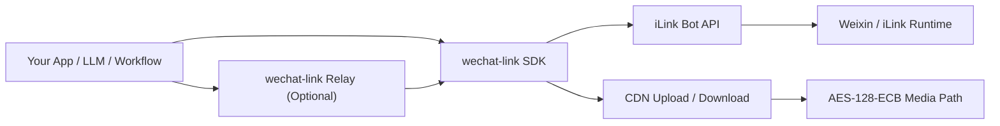
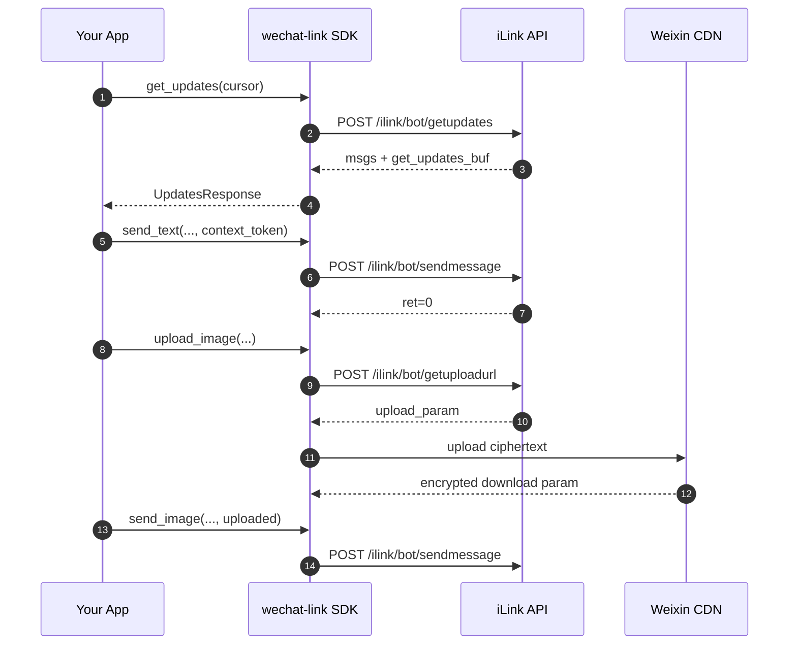

# wechat-link

<div align="center">


[](https://github.com/syusama/wechat-link)

**iLink 互換の Weixin Bot 連携に向けた、非公式の Python SDK。プロトコル整理、メディア経路、薄い Relay に重点を置いています。**

[简体中文](./README.md) | [English](./README.en.md) | [日本語](./README.ja.md)

[Quick Start](#クイックスタート) · [Capability Matrix](#現在の機能マトリクス) · [Relay](#relaysdk-を-http-サービスとして公開する) · [Contributing](./CONTRIBUTING.md)

</div>

---


## プロジェクトの位置づけ

`wechat-link` は、巨大な Bot プラットフォームを目指すものではありません。また、Tencent の公式サービスの代替として見せることも意図していません。

このプロジェクトの狙いは、かなり明確です。

> **iLink / Weixin Bot の主要な HTTP プロトコルを、クリーンで再利用しやすく、組み込みやすい Python SDK として整理し、その上に任意で薄い Relay を載せること。**

そのため、優先するのは次の点です。
- プロトコル境界が明確であること
- SDK API が安定していて組み合わせやすいこと
- メディアのアップロード / 送信フローが通っていること
- 自前アプリ、LLM、ワークフロー、社内サービスに接続しやすいこと

逆に、次のようなものを最初から目標にはしていません。
- 管理コンソール
- 運用プラットフォーム
- マルチアカウント管理画面
- 重いランタイム抽象を前提とした Bot フレームワーク

## なぜ `wechat-link` なのか

この領域のプロジェクトは、すぐに「Bot アプリケーション」へ膨らみがちです。すると、プロトコル処理、状態管理、業務ロジック、プロダクト機能が強く結びつき、保守が難しくなります。

`wechat-link` は、もう少し抑制的な設計を取ります。

- まずはログイン原語、ポーリング、メッセージ送信、typing、メディア経路を安定させる
- Relay は SDK の薄いラッパーとして保ち、別の製品にはしない
- プロトコルの詳細は明示的なモデルとインターフェースに落とし込む
- FastAPI、Django、LangChain、ジョブキュー、社内基盤に接続しやすくする
- 実際に維持できる範囲を超えて約束しない

## アーキテクチャ



### 内部レイヤー

- **`wechat_link.client`** — iLink API の中核クライアント
- **`wechat_link.media`** — メディア送信の編成、サムネイル情報、CDN アップロード
- **`wechat_link.cdn` / `wechat_link.crypto`** — CDN 通信と AES の詳細
- **`wechat_link.relay`** — 薄い FastAPI Relay 層
- **`wechat_link.store`** — `get_updates_buf` の最小永続化ヘルパー

## ライフサイクルとデータフロー



## 現在の機能マトリクス

| 機能 | 状態 | 備考 |
| --- | --- | --- |
| ログイン QR コード取得 | 実装済み | `get_bot_qrcode()` |
| QR 状態確認 | 実装済み | `get_qrcode_status()` |
| 長輪詢での受信 | 実装済み | `get_updates()` |
| カーソル永続化 | 実装済み | `FileCursorStore` |
| テキスト送信 | 実装済み | `send_text()` |
| typing 設定取得 | 実装済み | `get_config()` |
| typing 状態送信 | 実装済み | `send_typing()` |
| アップロード URL 取得 | 実装済み | `get_upload_url()` |
| 画像アップロード / 送信 | 実装済み | `upload_image()` / `send_image()` |
| ファイルアップロード / 送信 | 実装済み | `upload_file()` / `send_file()` |
| 動画アップロード / 送信 | 実装済み | `thumb_path` を明示指定可能 |
| 音声アップロード / 送信 | 実装済み | `upload_voice()` / `send_voice()` |
| 薄い Relay サービス | 実装済み | FastAPI ベース |
| 動画の自動サムネイル抽出 | 未実装 | 暗黙処理は行わない |
| 音声の自動トランスコード | 未実装 | ffmpeg / silk は同梱しない |
| 完全な Bot Runtime | 現段階の目標外 | SDK-first を維持 |

## インストール

### ソースから導入

```bash
git clone https://github.com/syusama/wechat-link.git
cd wechat-link
pip install -e .
```

### Relay 依存を含めて導入

```bash
pip install -e .[relay]
```

### 開発環境

```bash
pip install -e .[dev]
pytest -q
```

## クイックスタート

### 1) 更新をポーリングして Echo Bot を作る

```python
import time

from wechat_link import FileCursorStore, WeChatLinkClient

client = WeChatLinkClient(bot_token="your-bot-token")
store = FileCursorStore(".state/get_updates_buf.json")
cursor = store.load() or ""

try:
    while True:
        updates = client.get_updates(cursor=cursor)

        if updates.next_cursor:
            cursor = updates.next_cursor
            store.save(cursor)

        for message in updates.messages:
            text = message.text().strip()
            if not text or not message.from_user_id or not message.context_token:
                continue

            client.send_text(
                to_user_id=message.from_user_id,
                text=f"echo: {text}",
                context_token=message.context_token,
            )

        time.sleep(1)
finally:
    client.close()
```

対応例: `examples/echo_bot.py`

### 2) 低レベルの QR ログイン原語

現行バージョンでは、**QR ログインの原語**を提供しており、完全なログインオーケストレータはまだ含めていません。

```python
import time

from wechat_link import WeChatLinkClient

client = WeChatLinkClient()
qr = client.get_bot_qrcode()
print(qr.qrcode)

while True:
    status = client.get_qrcode_status(qr.qrcode)
    print(status.status)

    if status.status == "confirmed":
        print("bot_token:", status.bot_token)
        print("baseurl:", status.baseurl)
        print("ilink_bot_id:", status.ilink_bot_id)
        print("ilink_user_id:", status.ilink_user_id)
        break

    time.sleep(1)
```

これは意図的です。現段階では、便利なランタイム機能を増やすより、プロトコル境界を明確に保つことを優先しています。

### 3) 画像 / 動画を送る

```python
from wechat_link.client import WeChatLinkClient

client = WeChatLinkClient(bot_token="your-bot-token")

uploaded = client.upload_image(
    file_path="demo.jpg",
    to_user_id="user@im.wechat",
)

client.send_image(
    to_user_id="user@im.wechat",
    uploaded=uploaded,
    context_token="ctx-from-inbound-message",
)

uploaded_video = client.upload_video(
    file_path="demo.mp4",
    to_user_id="user@im.wechat",
    thumb_path="thumb.jpg",
)

client.send_video(
    to_user_id="user@im.wechat",
    uploaded=uploaded_video,
    context_token="ctx-from-inbound-message",
)

client.close()
```

対応例: `examples/send_media.py`

## Relay: SDK を HTTP として公開する

Python SDK を別言語や別サービス、社内基盤につなぎたい場合は、内蔵の薄い Relay を使えます。大きなフレームワークにはせず、必要最小限の HTTP 境界だけを提供します。

### Relay の起動

```bash
uvicorn examples.relay_server:app --reload
```

対応例: `examples/relay_server.py`

### 提供ルート

| メソッド | パス | 用途 |
| --- | --- | --- |
| `GET` | `/health` | ヘルスチェック |
| `GET` | `/login/qrcode` | ログイン QR 取得 |
| `GET` | `/login/status` | QR 状態確認 |
| `POST` | `/config` | typing 設定取得 |
| `POST` | `/typing` | typing 状態送信 |
| `POST` | `/updates/poll` | 更新取得 |
| `POST` | `/messages/text` | テキスト送信 |
| `POST` | `/messages/image/upload` | 画像アップロード＋送信 |
| `POST` | `/messages/file/upload` | ファイルアップロード＋送信 |
| `POST` | `/messages/video/upload` | 動画アップロード＋送信 |
| `POST` | `/messages/voice/upload` | 音声アップロード＋送信 |

### Relay の利用例

```bash
curl -X POST http://127.0.0.1:8000/messages/image/upload \
  -F "to_user_id=user@im.wechat" \
  -F "context_token=ctx-1" \
  -F "file=@demo.jpg"
```

```bash
curl -X POST http://127.0.0.1:8000/messages/video/upload \
  -F "to_user_id=user@im.wechat" \
  -F "context_token=ctx-1" \
  -F "file=@demo.mp4" \
  -F "thumb_file=@thumb.jpg"
```

## プロトコル上の要点

### 1. `context_token` は返信契約の中核

同じ会話に返信する場合、上流メッセージの `context_token` を必ず引き継ぐ必要があります。`wechat-link` はその文脈を勝手に推測しません。

### 2. `get_updates_buf` は必ず永続化する

`get_updates_buf` は長輪詢カーソルです。永続化しないと、最も起きやすい問題は重複受信です。`FileCursorStore` はそのための小さく実用的なヘルパーです。

### 3. メディア送信は単一 API ではなくワークフロー

実際のメディア送信は通常、次の 3 段階です。
1. `get_upload_url()` を呼ぶ
2. 暗号化済みバイト列を CDN へアップロードする
3. `sendmessage` 用のメディアメッセージを組み立てて送る

### 4. ヘッダは SDK が自動構築する

SDK は主要な CGI POST リクエストに対して、次のヘッダを自動構築します。

```text
Content-Type: application/json
AuthorizationType: ilink_bot_token
Authorization: Bearer <bot_token>
X-WECHAT-UIN: base64(decimal(random_uint32))
```

### 5. メディア経路には AES-128-ECB 処理が含まれる

現行実装では、すでに次をカバーしています。
- CDN アップロードパラメータの処理
- AES-128-ECB のパディング後サイズ計算
- 暗号化ダウンロードパラメータの伝播
- 画像 / ファイル / 動画 / 音声のメッセージ封包

## 明確な境界

`wechat-link` は **非公式プロジェクト** です。

Tencent を代表するものではなく、公式プラットフォームとして説明すべきでもありません。より正確には、次のように表現できます。

> **An unofficial Python SDK for iLink-compatible Weixin bot integration.**

また、次のようなものを目標にもしていません。
- 複数アカウント運用コンソール
- 大規模群制御プラットフォーム
- マーケティング自動化ダッシュボード
- プロトコル層と強結合した巨大 Bot フレームワーク

## コントリビューション

Issue や PR を出す前に、まず次を確認してください。

- [`CONTRIBUTING.md`](./CONTRIBUTING.md)

現時点で特に歓迎される分野は次のとおりです。

- プロトコル挙動の検証と補正
- メディア経路の安定性と境界ケース対応
- テスト強化とドキュメント精度向上
- プロジェクト境界を広げない範囲での構造整理

## License

MIT
