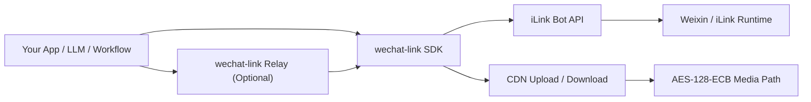
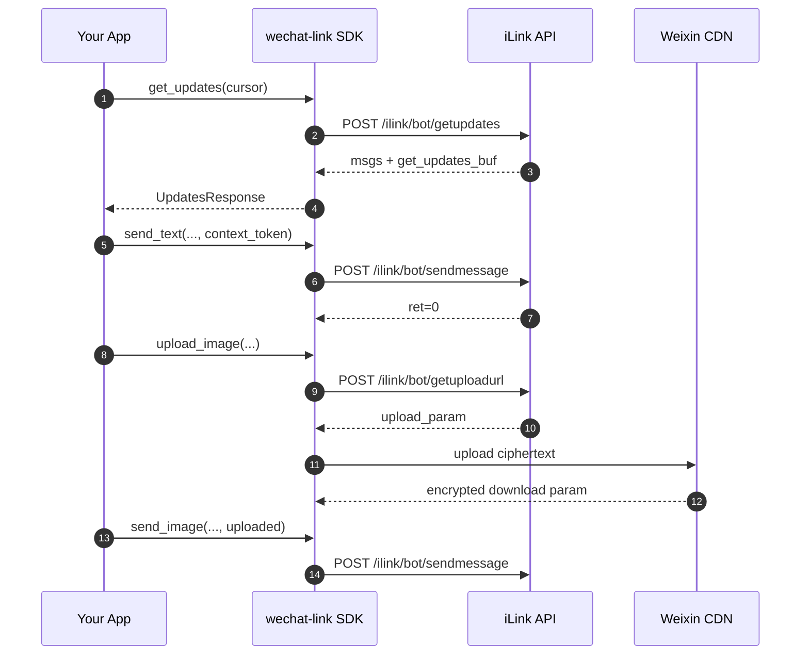

# wechat-link

<div align="center">


[](https://github.com/syusama/wechat-link)

**一个面向 iLink-compatible Weixin Bot 集成的非官方 Python SDK，专注协议层、媒体链路与薄中转服务。**

[简体中文](./README.md) | [English](./README.en.md) | [日本語](./README.ja.md)

[安装](#安装) · [快速开始](#快速开始) · [能力矩阵](#当前能力矩阵) · [Relay](#relay把-sdk-暴露为-http-服务) · [贡献指南](./CONTRIBUTING.md)

</div>

---


## 立即安装

### 从 PyPI 安装

```bash
pip install wechat-link
```

### 安装 Relay 依赖

```bash
pip install "wechat-link[relay]"
```

### 安装后最小示例

```python
from wechat_link import Client

client = Client(bot_token="your-bot-token")
messages = client.get_updates(cursor="").messages

print("messages:", len(messages))

client.close()
```

## 项目定位

`wechat-link` 不是一个“大而全”的机器人平台，也不是一个包装成“官方开放平台替代品”的外壳。

它的定位非常明确：

> **把 iLink / 微信 Bot 的关键 HTTP 协议整理成一个干净、可复用、可嵌入、可持续维护的 Python SDK，并提供一个可选的薄 Relay。**

这意味着它优先解决的是：
- 协议边界是否清晰
- SDK 是否足够稳定、可读、可组合
- 媒体上传链路是否完整
- 是否能方便接入自己的应用、LLM、工作流或服务端

而不是一开始就去做：后台系统、群控平台、多账号运营面板、复杂业务编排。

## 为什么是 `wechat-link`

大多数相关项目会很快长成一个“机器人应用”，协议层、业务逻辑、运行时状态、平台功能缠在一起，短期看上去很快，长期却很难维护。

`wechat-link` 的处理方式相对克制：

- 先把登录、轮询、发消息、typing、媒体链路做稳
- Relay 只是 SDK 的一层薄封装，不再额外造一套系统
- 协议细节尽量落到明确的数据结构和接口里
- 默认考虑接入 FastAPI、Django、LangChain、任务队列和内部服务
- 少承诺还没做好的能力，优先把核心链路维护清楚

## 架构概览



### 设计分层

- **`wechat_link.client`**：对 iLink API 的核心调用封装
- **`wechat_link.media`**：媒体上传编排、缩略图元数据处理、CDN 上传流程
- **`wechat_link.cdn` / `wechat_link.crypto`**：CDN 传输与 AES 细节
- **`wechat_link.relay`**：薄 FastAPI 中转层，方便把 SDK 暴露为 HTTP 服务
- **`wechat_link.store`**：`get_updates_buf` 的持久化辅助

## 生命周期与数据流



## 当前能力矩阵

| 能力 | 状态 | 说明 |
| --- | --- | --- |
| 获取登录二维码 | 已实现 | `get_bot_qrcode()` |
| 查询二维码状态 | 已实现 | `get_qrcode_status()` |
| 长轮询收消息 | 已实现 | `get_updates()` |
| 游标持久化 | 已实现 | `FileCursorStore` |
| 发送文本 | 已实现 | `send_text()` |
| 获取 typing 配置 | 已实现 | `get_config()` |
| 发送 typing 状态 | 已实现 | `send_typing()` |
| 请求上传地址 | 已实现 | `get_upload_url()` |
| 图片上传 / 发送 | 已实现 | `upload_image()` / `send_image()` |
| 文件上传 / 发送 | 已实现 | `upload_file()` / `send_file()` |
| 视频上传 / 发送 | 已实现 | 支持显式 `thumb_path` |
| 语音上传 / 发送 | 已实现 | `upload_voice()` / `send_voice()` |
| 薄 Relay 服务 | 已实现 | FastAPI 路由封装 |
| 自动视频抽帧 | 未实现 | 当前不做隐式媒体处理 |
| 自动语音转码 | 未实现 | 当前不引入 ffmpeg / silk 工具链 |
| 完整 Bot Runtime | 非当前目标 | 保持 SDK-first 边界 |

## 安装

### 从 PyPI 安装（推荐）

```bash
pip install wechat-link
```

### 安装 Relay 依赖

```bash
pip install "wechat-link[relay]"
```

### 从源码安装（开发场景）

```bash
git clone https://github.com/syusama/wechat-link.git
cd wechat-link
pip install -e .
```

### 开发环境

```bash
pip install -e .[dev]
pytest -q
```

## 上手顺序

第一次接入时，建议按下面的顺序走：

1. **先扫码登录**，拿到 `bot_token`
2. **再初始化 `Client`**，把 `bot_token` 传进去
3. **最后开始轮询 / 发消息 / 发媒体**

需要特别注意的是：

- 扫码成功后通常会拿到 `bot_token`、`baseurl`、`ilink_bot_id`、`ilink_user_id`
- 其中 **SDK 初始化真正要用的是 `bot_token`**
- `ilink_bot_id` 很有用，但它不是 `Client(...)` 的入参替代品

## 快速开始

### 1) 先扫码登录，拿到 `bot_token`

当前版本提供的是**扫码登录原语**，而不是完整的登录编排器。

```python
import time

from wechat_link import Client

client = Client()
qr = client.get_bot_qrcode()
print(qr.qrcode)

while True:
    status = client.get_qrcode_status(qr.qrcode)
    print(status.status)

    if status.status == "confirmed":
        print("bot_token:", status.bot_token)
        print("baseurl:", status.baseurl)
        print("ilink_bot_id:", status.ilink_bot_id)
        print("ilink_user_id:", status.ilink_user_id)
        break

    time.sleep(1)
```

这里最关键的是把 `bot_token` 保存好。后面的 `Client(bot_token=...)` 就从这里拿值。

### 2) 使用 `bot_token` 收消息并回显

```python
from wechat_link import Client, FileCursorStore

client = Client(bot_token="your-bot-token")
store = FileCursorStore(".state/get_updates_buf.json")
cursor = store.load() or ""

updates = client.get_updates(cursor=cursor)
if updates.next_cursor:
    store.save(updates.next_cursor)

for message in updates.messages:
    text = message.text().strip()
    if text and message.from_user_id and message.context_token:
        client.send_text(
            to_user_id=message.from_user_id,
            text=f"echo: {text}",
            context_token=message.context_token,
        )

client.close()
```

完整长轮询版本见：`examples/echo_bot.py`

### 3) 发送图片

```python
from wechat_link import Client

client = Client(bot_token="your-bot-token")

uploaded = client.upload_image(
    file_path="demo.jpg",
    to_user_id="user@im.wechat",
)

client.send_image(
    to_user_id="user@im.wechat",
    uploaded=uploaded,
    context_token="ctx-from-inbound-message",
)

client.close()
```

文件 / 视频 / 语音的完整示例见：`examples/send_media.py`

## Relay：把 SDK 暴露为 HTTP 服务

如果你希望把 Python SDK 接到其他语言、其他服务、或者内部平台上，可以使用内置的薄 Relay。

### 启动 Relay

```bash
uvicorn examples.relay_server:app --reload
```

对应示例：`examples/relay_server.py`

### 已提供的路由

| 方法 | 路径 | 用途 |
| --- | --- | --- |
| `GET` | `/health` | 健康检查 |
| `GET` | `/login/qrcode` | 获取登录二维码 |
| `GET` | `/login/status` | 查询二维码状态 |
| `POST` | `/config` | 获取 typing 配置 |
| `POST` | `/typing` | 发送 typing 状态 |
| `POST` | `/updates/poll` | 长轮询消息 |
| `POST` | `/messages/text` | 发文本消息 |
| `POST` | `/messages/image/upload` | 上传并发送图片 |
| `POST` | `/messages/file/upload` | 上传并发送文件 |
| `POST` | `/messages/video/upload` | 上传并发送视频 |
| `POST` | `/messages/voice/upload` | 上传并发送语音 |

### Relay 调用示例

```bash
curl -X POST http://127.0.0.1:8000/messages/image/upload \
  -F "to_user_id=user@im.wechat" \
  -F "context_token=ctx-1" \
  -F "file=@demo.jpg"
```

```bash
curl -X POST http://127.0.0.1:8000/messages/video/upload \
  -F "to_user_id=user@im.wechat" \
  -F "context_token=ctx-1" \
  -F "file=@demo.mp4" \
  -F "thumb_file=@thumb.jpg"
```

## 协议要点

### 1. `context_token` 是回复链路的关键

回复同一会话时，必须把上游消息里的 `context_token` 带回去。`wechat-link` 不会替你“猜测上下文”，这是协议层最关键的边界之一。

### 2. `get_updates_buf` 必须持久化

`get_updates_buf` 是长轮询游标。如果不持久化，最常见的问题就是重复消费消息。当前仓库通过 `FileCursorStore` 提供了一个极简但够用的本地持久化方案。

### 3. 媒体发送不是单个接口，而是一条链路

媒体发送通常分成三步：
1. `get_upload_url()` 申请上传参数
2. 上传加密后的文件到 CDN
3. 用上传结果组装 `sendmessage` 的媒体消息体

### 4. 请求头由 SDK 自动构造

所有核心 CGI POST 请求都会自动构造以下头部：

```text
Content-Type: application/json
AuthorizationType: ilink_bot_token
Authorization: Bearer <bot_token>
X-WECHAT-UIN: base64(decimal(random_uint32))
```

### 5. 媒体链路包含 AES-128-ECB 处理

当前实现已经覆盖：
- CDN 上传参数拼装
- AES-128-ECB 加密尺寸计算
- CDN 下载参数回传
- 图片 / 文件 / 视频 / 语音的协议消息封包

## 明确边界

`wechat-link` 是一个 **非官方项目**。

它不代表腾讯官方，不应被描述为腾讯官方开放平台，也不应被包装成某种“官方替代品”。更准确的描述是：

> **An unofficial Python SDK for iLink-compatible Weixin bot integration.**

同样地，当前项目也**不以**以下能力为目标：
- 多账号运营后台
- 大规模群控平台
- 营销自动化面板
- 与协议层强耦合的大型 Bot Framework

## 参与贡献

如果你打算提 Issue 或 PR，建议先看：

- [`CONTRIBUTING.md`](./CONTRIBUTING.md)

当前更适合投入精力的方向有：

- 协议行为核对与纠偏
- 媒体链路稳定性与边界处理
- 测试覆盖与文档准确性
- 在不扩大项目边界的前提下做结构瘦身

## License

MIT
