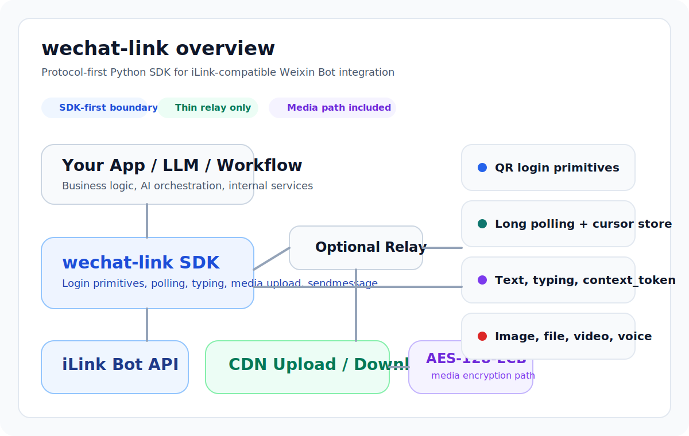
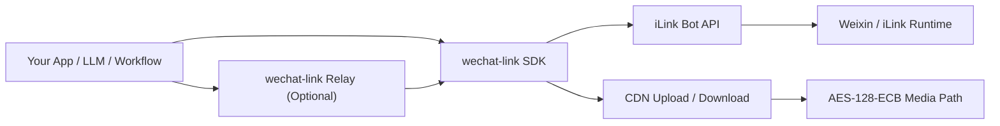
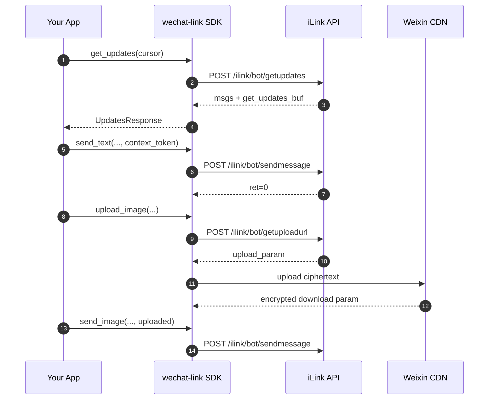

# wechat-link

<div align="center">


[](https://github.com/syusama/wechat-link)

**一行代码桥接微信，把你的应用、Agent、工作流直接接进聊天窗口。**

扫码就能登录，几行代码就能收消息、回消息、发图片/文件。  
不用先搭后台，不用先造平台，也不用先啃一堆协议细节。

[简体中文](./README.md) | [English](./README.en.md) | [日本語](./README.ja.md)

[安装](#立即安装) · [为什么用起来省心](#为什么用起来省心) · [快速开始](#快速开始) · [能力矩阵](#当前能力矩阵) · [Relay](#relay把-sdk-暴露为-http-服务) · [贡献指南](./CONTRIBUTING.md)

</div>

---



## 立即安装

### 从 PyPI 安装

```bash
pip install wechat-link
```

### 安装 Relay 依赖

```bash
pip install "wechat-link[relay]"
```

### 安装后最小示例

```python
from wechat_link import Client

client = Client(bot_token="your-bot-token")
messages = client.get_updates(cursor="").messages

print("messages:", len(messages))

client.close()
```

## 这个项目到底帮你省掉了什么

很多人接微信时，真正卡住的不是业务逻辑，而是这些麻烦事：

- 不想为了“接个微信”先搭一整套机器人平台
- 不想自己研究登录、轮询、上下文、媒体上传这些细节
- 不想把时间花在协议和 CDN 链路上，而不是花在自己的产品上
- 不想项目刚开始就被接入成本劝退

`wechat-link` 做的事情很简单：

> **把“微信接入”这件事压缩成少量清晰代码，让你先跑起来，再按自己的方式扩展。**

## 为什么用起来省心

- 登录、收消息、回消息、typing、图片/文件/视频/语音链路都已经接好
- 可以直接嵌进你现有的 Python 应用，不强迫你换技术栈
- 想直接写 SDK 就直接写；想暴露成 HTTP 服务，再开一个薄 Relay 就够了
- 业务逻辑、Agent、工作流、内部系统都可以继续按你的方式组织
- 整体边界很克制，不会为了“看起来很全”把项目拖成一个笨重平台

## 适合什么场景

- 想把微信接到现有应用、内部系统或自动化流程里
- 想让 LLM / Agent / 工作流直接通过微信收发消息
- 想先把链路跑通，再逐步补业务能力，而不是先做后台和控制台
- 想自己掌控代码、部署和集成方式，不想被一个大平台绑定

它不是官方 SDK，也不打算假装成“官方开放平台替代品”。  
如果你要的是完整运营后台、群控系统或重度业务编排，这不是当前目标；如果你要的是**简单、快捷、可嵌入地把微信接起来**，它就是为这个场景准备的。

## 架构概览



### 设计分层

- **`wechat_link.client`**：对 iLink API 的核心调用封装
- **`wechat_link.media`**：媒体上传编排、缩略图元数据处理、CDN 上传流程
- **`wechat_link.cdn` / `wechat_link.crypto`**：CDN 传输与 AES 细节
- **`wechat_link.relay`**：薄 FastAPI 中转层，方便把 SDK 暴露为 HTTP 服务
- **`wechat_link.store`**：`get_updates_buf` 的持久化辅助

## 生命周期与数据流



## 当前能力矩阵

| 能力 | 状态 | 说明 |
| --- | --- | --- |
| 获取登录二维码 | 已实现 | `get_bot_qrcode()` |
| 终端打印二维码 | 已实现 | `render_qrcode_terminal()` / `print_qrcode_terminal()` |
| 查询二维码状态 | 已实现 | `get_qrcode_status()` |
| 长轮询收消息 | 已实现 | `get_updates()` |
| 游标持久化 | 已实现 | `FileCursorStore` |
| 发送文本 | 已实现 | `send_text()` |
| 获取 typing 配置 | 已实现 | `get_config()` |
| 发送 typing 状态 | 已实现 | `send_typing()` |
| 请求上传地址 | 已实现 | `get_upload_url()` |
| 图片上传 / 发送 | 已实现 | `upload_image()` / `send_image()` |
| 文件上传 / 发送 | 已实现 | `upload_file()` / `send_file()` |
| 视频上传 / 发送 | 已实现 | 支持显式 `thumb_path` |
| 语音上传 / 发送 | 已实现 | `upload_voice()` / `send_voice()` |
| 薄 Relay 服务 | 已实现 | FastAPI 路由封装 |
| 自动视频抽帧 | 未实现 | 当前不做隐式媒体处理 |
| 自动语音转码 | 未实现 | 当前不引入 ffmpeg / silk 工具链 |
| 完整 Bot Runtime | 非当前目标 | 保持 SDK-first 边界 |

## 安装

### 从 PyPI 安装（推荐）

```bash
pip install wechat-link
```

### 安装 Relay 依赖

```bash
pip install "wechat-link[relay]"
```

### 从源码安装（开发场景）

```bash
git clone https://github.com/syusama/wechat-link.git
cd wechat-link
pip install -e .
```

### 开发环境

```bash
pip install -e .[dev]
pytest -q
```

## 上手顺序

第一次接入时，建议按下面的顺序走：

1. **先扫码登录**，拿到 `bot_token`
2. **再初始化 `Client`**，把 `bot_token` 传进去
3. **最后开始轮询 / 发消息 / 发媒体**

需要特别注意的是：

- 扫码成功后通常会拿到 `bot_token`、`baseurl`、`ilink_bot_id`、`ilink_user_id`
- 其中 **SDK 初始化真正要用的是 `bot_token`**
- `ilink_bot_id` 很有用，但它不是 `Client(...)` 的入参替代品

## 快速开始

### 1) 先登录，保存本地 session

最简单的运行方式：

```bash
python examples/login_session.py
```

这个脚本会：

- 拉取登录二维码
- 把二维码保存到 `.state/wechat-login-qrcode.png`
- 在控制台打印二维码
- 扫码成功后把 `bot_token` 等信息保存到 `.state/wechat-link-session.json`

如果你更想看最核心的 SDK 调用，登录本质上就是下面这几步：

```python
import time
from pathlib import Path

from wechat_link import Client

client = Client()
qr = client.get_bot_qrcode()
image_path = client.save_qrcode_image(
    qr.qrcode_img_content,
    output_path=Path(".state") / "wechat-login-qrcode.png",
)

print(qr.qrcode)
print(image_path)
print(qr.qrcode_img_content)
print(client.render_qrcode_terminal(qr.qrcode_img_content))

while True:
    status = client.get_qrcode_status(qr.qrcode)
    print(status.status)

    if status.status == "confirmed":
        print("bot_token:", status.bot_token)
        print("baseurl:", status.baseurl)
        print("ilink_bot_id:", status.ilink_bot_id)
        print("ilink_user_id:", status.ilink_user_id)
        break

    time.sleep(1)
```

这里最关键的是把 `bot_token` 保存好。后面的所有消息示例都要用它。`qrcode_img_content` 当前返回的是一个可访问 URL；如果它指向的是二维码页面而不是原始图片，SDK 会在本地生成真正的二维码图片。`save_qrcode_image(...)` 会把结果保存到本地，`render_qrcode_terminal(...)` / `print_qrcode_terminal(...)` 则可以直接在控制台输出二维码。

### 2) 先收一条微信消息

最简单的运行方式：

```bash
python examples/receive_once.py
```

这个示例会：

- 读取你本地 `.state/wechat-link-session.json` 里的 `bot_token`
- 发起一次 `get_updates()` 长轮询
- 打印新消息里的 `from_user_id`、`context_token`、`text`
- 把最近一条可回复消息保存到 `.state/last-message-context.json`

最核心的接收逻辑其实很简单：

```python
updates = client.get_updates(cursor=cursor)

for message in updates.messages:
    print(message.from_user_id)
    print(message.context_token)
    print(message.text())
```

如果你执行后“看起来没反应”，通常不是代码坏了，而是它正在等新消息：

- `get_updates()` 是**长轮询**
- 它会等一段时间看看有没有新消息
- 如果你没有在脚本运行后从微信给 bot 发一条新消息，它就不会有可打印内容

所以最简单的测试方式是：

1. 先运行 `python examples/receive_once.py`
2. 然后立刻用微信给 bot 发一条“你好”
3. 回到终端看输出

### 3) 回复刚收到的那条消息

最简单的运行方式：

```bash
python examples/reply_once.py
```

这个示例会等待一条新的文本消息，收到后马上回复一条：

```python
client.send_text(
    to_user_id=message.from_user_id,
    text=f"received: {text}",
    context_token=message.context_token,
)
```

这里有两个关键点：

- `to_user_id`：回给谁
- `context_token`：回到哪一条会话上下文

也就是说，这不是“凭空主动发消息”，而是**在刚收到的那条消息所在会话里回复**。

### 4) 在已有会话里主动再发一条文本

最简单的运行方式：

```bash
python examples/send_text_in_session.py
```

这个示例会读取 `.state/last-message-context.json`，然后在**同一会话里**主动再发一条文本。它本质上做的是：

```python
client.send_text(
    to_user_id=context["from_user_id"],
    text="this is a proactive message in the same session",
    context_token=context["context_token"],
)
```

这也是为什么我前面一直强调 `context_token`：当前最稳的“主动发送”，其实是**基于已经建立的会话继续发**，不是冷启动给任意用户随便发第一条消息。

### 5) 补充：在已有会话里发送图片

文本消息理解清楚后，再看媒体发送会容易很多。图片发送也是同一个思路：先准备上传，再在已有会话里发送。

```python
uploaded = client.upload_image(
    file_path="demo.jpg",
    to_user_id="user@im.wechat",
)

client.send_image(
    to_user_id="user@im.wechat",
    uploaded=uploaded,
    context_token="ctx-from-inbound-message",
)
```

文件 / 视频 / 语音的完整示例见：`examples/send_media.py`

### 6) 推荐你按这个顺序跑示例

如果你是第一次接入，最推荐的顺序是：

1. `python examples/login_session.py`
2. `python examples/receive_once.py`
3. `python examples/reply_once.py`
4. `python examples/send_text_in_session.py`
5. `python examples/echo_bot.py`

这样你会非常清楚地看到：

- 微信消息是怎么被 SDK 收到的
- 回复为什么必须带 `context_token`
- “主动发送”在当前协议边界下到底是什么意思

## 快速上手教程

如果你希望**直接拷贝运行完整流程**，推荐用下面这个三步示例。

运行方式：

```bash
python examples/quickstart_three_steps.py
```

仓库内的示例脚本会优先加载本地 `src/wechat_link`，不会误导入你环境里已安装的旧版 `site-packages/wechat_link`。脚本产生的二维码、会话和游标文件都会落在仓库根目录的 `.state/` 下，并打印绝对路径。

如果你更想按“拆开的最小步骤”理解消息流程，优先看：

- `examples/login_session.py`
- `examples/receive_once.py`
- `examples/reply_once.py`
- `examples/send_text_in_session.py`
- `examples/echo_bot.py`

这个脚本会自动完成：

1. 请求登录二维码，并把二维码图片保存到仓库根目录 `.state/wechat-login-qrcode.png`，同时在控制台打印二维码
2. 轮询扫码状态，登录成功后把 `bot_token` 等信息保存到仓库根目录 `.state/wechat-link-session.json`
3. 用保存下来的 `bot_token` 启动 echo 循环

完整示例：

```python
import json
import time
from pathlib import Path

import httpx

from wechat_link import Client, FileCursorStore

STATE_DIR = Path(".state")
SESSION_PATH = STATE_DIR / "wechat-link-session.json"
CURSOR_PATH = STATE_DIR / "get_updates_buf.json"
QR_IMAGE_PATH = STATE_DIR / "wechat-login-qrcode.png"


def ensure_state_dir():
    STATE_DIR.mkdir(parents=True, exist_ok=True)


def load_session():
    if not SESSION_PATH.exists():
        return None
    return json.loads(SESSION_PATH.read_text(encoding="utf-8"))


def save_session(session):
    ensure_state_dir()
    SESSION_PATH.write_text(
        json.dumps(session, ensure_ascii=False, indent=2),
        encoding="utf-8",
    )


def save_qr_image(client, qrcode_img_content):
    if not qrcode_img_content:
        return None

    try:
        return client.save_qrcode_image(
            qrcode_img_content,
            output_path=QR_IMAGE_PATH,
        )
    except Exception:
        return None


def login():
    client = Client()
    qr = client.get_bot_qrcode()

    print("Step 1/3: 请使用微信扫码登录")
    print("qrcode:", qr.qrcode)
    print("qrcode_url:", qr.qrcode_img_content)

    image_path = save_qr_image(client, qr.qrcode_img_content)
    if image_path:
        print("二维码图片已保存到:", image_path.resolve())
    else:
        print("未能自动保存二维码图片，请直接打开 qrcode_url")

    print("terminal qr:")
    client.print_qrcode_terminal(qr.qrcode_img_content)

    try:
        while True:
            try:
                status = client.get_qrcode_status(qr.qrcode)
            except httpx.TimeoutException:
                print("二维码状态查询超时，继续等待...")
                continue

            print("扫码状态:", status.status)

            if status.status == "confirmed" and status.bot_token:
                session = {
                    "bot_token": status.bot_token,
                    "base_url": status.baseurl or "https://ilinkai.weixin.qq.com",
                    "ilink_bot_id": status.ilink_bot_id or "",
                    "ilink_user_id": status.ilink_user_id or "",
                }
                save_session(session)
                print("登录成功，凭证已保存到:", SESSION_PATH.resolve())
                return session

            time.sleep(1)
    finally:
        client.close()


def get_or_login_session():
    session = load_session()
    if session and session.get("bot_token"):
        print("Step 1/3: 检测到本地凭证，跳过扫码")
        return session
    return login()


def start_echo(session):
    print("Step 2/3: 初始化 Client")
    client = Client(
        bot_token=session["bot_token"],
        base_url=session.get("base_url", "https://ilinkai.weixin.qq.com"),
    )
    store = FileCursorStore(CURSOR_PATH)
    cursor = store.load() or ""

    print("Step 3/3: 启动 echo 循环，给机器人发消息测试")
    print("现在请从微信给 bot 发一条新消息。")

    try:
        while True:
            try:
                updates = client.get_updates(cursor=cursor)
            except httpx.TimeoutException:
                print("get_updates 超时，继续轮询...")
                continue

            if updates.next_cursor:
                cursor = updates.next_cursor
                store.save(cursor)

            if not updates.messages:
                print("这一轮没有收到新消息。")
                time.sleep(1)
                continue

            for message in updates.messages:
                text = message.text().strip()
                if not text or not message.from_user_id or not message.context_token:
                    continue

                print("收到消息:", text)
                client.send_text(
                    to_user_id=message.from_user_id,
                    text=f"echo: {text}",
                    context_token=message.context_token,
                )

            time.sleep(1)
    finally:
        client.close()


def main():
    ensure_state_dir()
    session = get_or_login_session()
    start_echo(session)


if __name__ == "__main__":
    main()
```

仓库内可直接运行版本见：`examples/quickstart_three_steps.py`

## Relay：把 SDK 暴露为 HTTP 服务

如果你希望把 Python SDK 接到其他语言、其他服务、或者内部平台上，可以使用内置的薄 Relay。

### 启动 Relay

```bash
uvicorn examples.relay_server:app --reload
```

对应示例：`examples/relay_server.py`

### 已提供的路由

| 方法 | 路径 | 用途 |
| --- | --- | --- |
| `GET` | `/health` | 健康检查 |
| `GET` | `/login/qrcode` | 获取登录二维码 |
| `GET` | `/login/status` | 查询二维码状态 |
| `POST` | `/config` | 获取 typing 配置 |
| `POST` | `/typing` | 发送 typing 状态 |
| `POST` | `/updates/poll` | 长轮询消息 |
| `POST` | `/messages/text` | 发文本消息 |
| `POST` | `/messages/image/upload` | 上传并发送图片 |
| `POST` | `/messages/file/upload` | 上传并发送文件 |
| `POST` | `/messages/video/upload` | 上传并发送视频 |
| `POST` | `/messages/voice/upload` | 上传并发送语音 |

### Relay 调用示例

```bash
curl -X POST http://127.0.0.1:8000/messages/image/upload \
  -F "to_user_id=user@im.wechat" \
  -F "context_token=ctx-1" \
  -F "file=@demo.jpg"
```

```bash
curl -X POST http://127.0.0.1:8000/messages/video/upload \
  -F "to_user_id=user@im.wechat" \
  -F "context_token=ctx-1" \
  -F "file=@demo.mp4" \
  -F "thumb_file=@thumb.jpg"
```

## 协议要点

### 1. `context_token` 是回复链路的关键

回复同一会话时，必须把上游消息里的 `context_token` 带回去。`wechat-link` 不会替你“猜测上下文”，这是协议层最关键的边界之一。

### 2. `get_updates_buf` 必须持久化

`get_updates_buf` 是长轮询游标。如果不持久化，最常见的问题就是重复消费消息。当前仓库通过 `FileCursorStore` 提供了一个极简但够用的本地持久化方案。

### 3. 媒体发送不是单个接口，而是一条链路

媒体发送通常分成三步：
1. `get_upload_url()` 申请上传参数
2. 上传加密后的文件到 CDN
3. 用上传结果组装 `sendmessage` 的媒体消息体

### 4. 请求头由 SDK 自动构造

所有核心 CGI POST 请求都会自动构造以下头部：

```text
Content-Type: application/json
AuthorizationType: ilink_bot_token
Authorization: Bearer <bot_token>
X-WECHAT-UIN: base64(decimal(random_uint32))
```

### 5. 媒体链路包含 AES-128-ECB 处理

当前实现已经覆盖：
- CDN 上传参数拼装
- AES-128-ECB 加密尺寸计算
- CDN 下载参数回传
- 图片 / 文件 / 视频 / 语音的协议消息封包

## 明确边界

`wechat-link` 是一个 **非官方项目**。

它不代表腾讯官方，不应被描述为腾讯官方开放平台，也不应被包装成某种“官方替代品”。更准确的描述是：

> **An unofficial Python SDK for iLink-compatible Weixin bot integration.**

同样地，当前项目也**不以**以下能力为目标：
- 多账号运营后台
- 大规模群控平台
- 营销自动化面板
- 与协议层强耦合的大型 Bot Framework

## 参与贡献

如果你打算提 Issue 或 PR，建议先看：

- [`CONTRIBUTING.md`](./CONTRIBUTING.md)

当前更适合投入精力的方向有：

- 协议行为核对与纠偏
- 媒体链路稳定性与边界处理
- 测试覆盖与文档准确性
- 在不扩大项目边界的前提下做结构瘦身

## License

MIT
